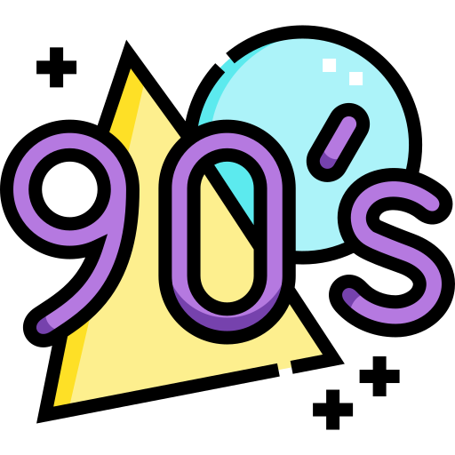

Connecting the Why, the What, and the How since the 
-------------------------------------------------------

I'm Jeremy, an Engineering leader and developer with expertise in connecting strategic vision to tactical execution. I have a proven record of building and empowering global, cross-functional teams while mentoring the next generation of technical leaders. I am seeking a high-impact role within a purpose-driven organization to partner with customers and transform complex strategic product goals into scalable, secure, and reliable solutions.

## 🛠️ Current Projects
- **The Villager App** A mobile-first app designed to support and empower positve youth development. Integrating AI for development, testing, and capabiltiies within the app itself.
- **Continous Learning and Improvement** Currently working on an AI Professional Certificate through IBM, as well as refreshing my PMP.

## 🚀 Professional Focus
- **Architecture:** Modern software design focusing on .NET 10, Azure, and Containerization (Docker/K8s).
- **Leadership:** Engineering Management with a focus on driving feature output and team scaling.
- **Technical Mastery:** Refreshing AZ-305 expertise and modernizing cloud-native skillsets.

## 🌲 Interests & Beyond
- **Outdoors:** Avid hiker and dog enthusiast based in Washington, D.C.
- **Music:** Exploring new soundscapes and curation.
- **Sports:** Keeping a close eye on sports analytics and NCAA bracketology.

### Skills

  <strong>Strategy & Executive Leadership</strong> 
  
  
  
  
  
  
  
  
  

   <strong>Program & Operations Management</strong> 
  
  

   <strong>Architecture & Infrastructure</strong> 
  
  
  
  
  
  

   <strong>Software Engineering & Data</strong> 
  
  
  
  
  

   <strong>Methodology & Quality Assurance</strong> 
  
  
  
  

